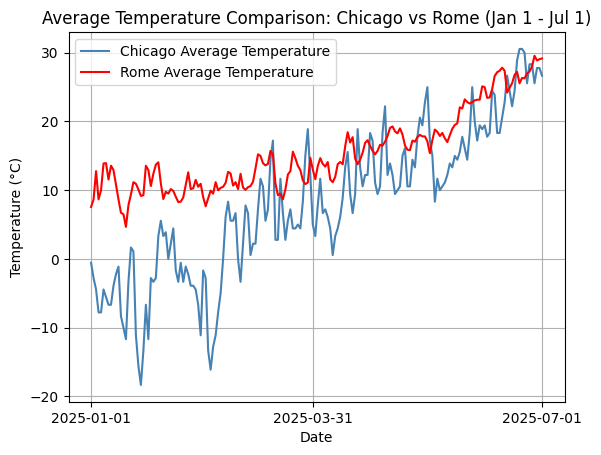
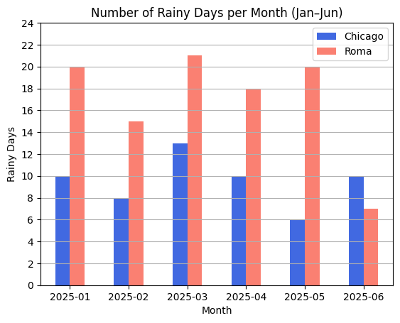
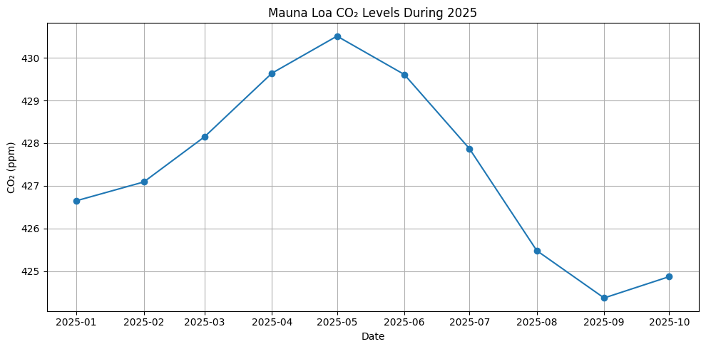
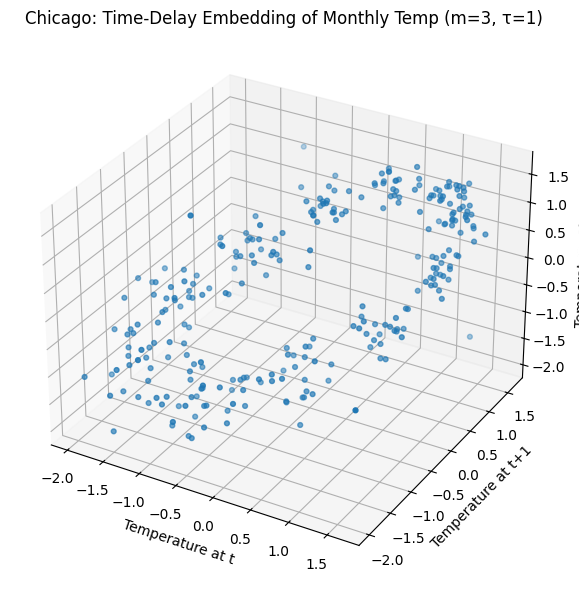
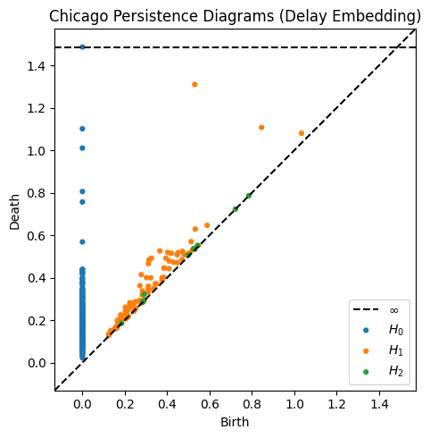
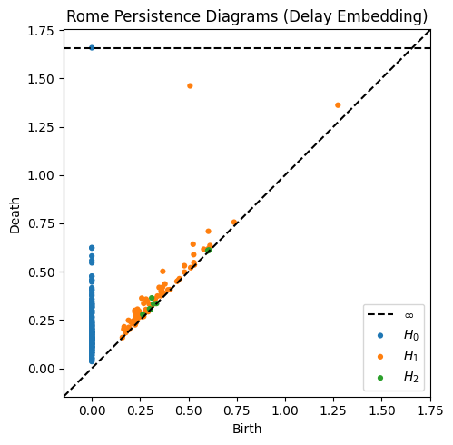
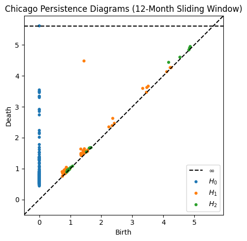
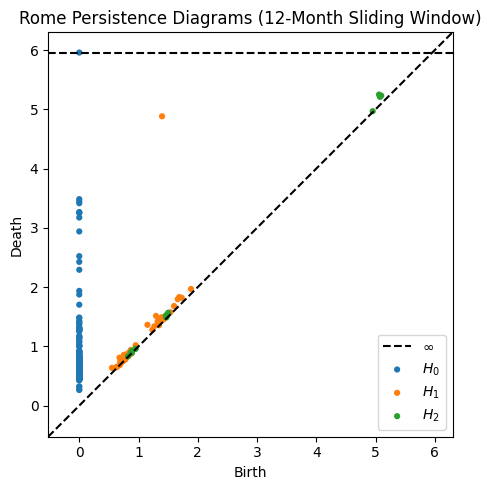

# Comparing Weather, CO₂, and Climate Topology of Rome and Chicago

## Authors

* Yinqi Wang
* Uli Rodriguez

## Colab Notebook

[Download the Colab notebook](HW6.ipynb)

---

## Introduction

This project compares weather patterns, atmospheric CO₂ trends, and climate structure for two cities located at similar latitudes: **Rome, Italy** and **Chicago, USA** (approximately 41°N). Although latitude strongly influences climate, it does not fully determine local weather conditions. Geographic factors such as proximity to oceans, prevailing winds, and continentality play a critical role in shaping temperature and precipitation patterns.

We analyze daily temperature, precipitation frequency, atmospheric CO₂ concentration, and monthly climate structure to investigate how geography influences short-term weather, long-term climate trends, and seasonal stability.

> **Hypothesis:** Because Rome is close to the Mediterranean Sea, it is warmer than Chicago, and the colder city experiences more precipitation.

---

## Weather Analysis: Temperature

### Daily Temperature Trends (Jan–Jul 2025)

The figure below compares daily average temperatures in Chicago and Rome.

Rome consistently exhibits higher temperatures than Chicago throughout the observation period. During winter months (January–March), Chicago frequently experiences temperatures below 0 °C, occasionally reaching nearly –20 °C, while Rome remains relatively mild, typically between 5–10 °C. This difference highlights the moderating influence of the Mediterranean Sea on Rome’s climate.

As spring progresses, both cities experience rising temperatures; however, Chicago’s warming is much more abrupt. Daily temperatures in Chicago increase rapidly from near-freezing conditions to above 20 °C, whereas Rome warms more gradually. This behavior is characteristic of continental climates, where land surfaces heat and cool quickly compared to maritime environments.

---

## Weather Analysis: Precipitation

### Monthly Rainy Days (Jan–Jun 2025)

The figure below shows the number of rainy days per month in each city.

Rome experiences significantly more rainy days than Chicago from January through May, averaging approximately 15–21 rainy days per month compared to Chicago’s 6–13. This pattern reflects the Mediterranean climate, where winter and early spring precipitation is common due to mid-latitude cyclones.

In June, however, this pattern reverses. Rome becomes substantially drier, while Chicago experiences increased rainfall. This shift is driven by strong summer convection in the Midwestern United States, which leads to frequent thunderstorms. This result contradicts our initial hypothesis and demonstrates that precipitation patterns depend not only on temperature but also on atmospheric circulation and seasonal dynamics.

---

## CO₂ vs Temperature Comparison (2025)

### CO₂ During Temperature Observation Period

The figure below shows CO₂ levels during the same period as the temperature data.

Atmospheric CO₂ concentrations change very gradually over the January–July 2025 period, increasing slightly through spring and declining modestly in summer. In contrast, daily temperatures in both Rome and Chicago fluctuate dramatically over short time scales.

This comparison demonstrates that short-term temperature variability is not driven by short-term CO₂ fluctuations. Instead, temperature differences between the two cities are dominated by local geography, air mass movement, and seasonal cycles. CO₂ influences climate on long time scales (decades), not daily or weekly weather patterns .

---

## Topological Data Analysis (TDA)

### Motivation

While traditional statistical methods summarize averages and trends, they do not capture the *shape* of climate dynamics. To better understand seasonal structure and stability, we applied **Topological Data Analysis (TDA)** to monthly temperature data from Meteostat.

TDA allows us to detect recurring geometric patterns, such as loops, which correspond to periodic behavior like annual seasonality.

---

### Time-Delay Embedding (m = 3, τ = 1)

**Chicago**

**Rome**

In the time-delay embedding, each point represents temperature at three consecutive months. Both cities form loop-like structures, indicating strong annual seasonality. However, Chicago’s loop is wider and more scattered, reflecting strong month-to-month variability.

Rome’s loop is tighter and smoother, indicating more stable transitions between seasons. This difference reflects the moderating influence of the Mediterranean Sea, which reduces temperature volatility throughout the year.

---

### Persistence Diagrams (Delay Embedding)

**Chicago**

**Rome**

Persistence diagrams quantify the strength of topological features. Rome exhibits a stronger dominant H₁ feature (maximum persistence 0.9529) compared to Chicago (0.7796). This indicates that Rome’s seasonal cycle is more coherent and less affected by noise, while Chicago’s seasonality is fragmented by abrupt temperature changes.

---

### 12-Month Sliding Window Embedding

**Chicago**

**Rome**

The sliding window embedding captures full-year temperature patterns. Rome exhibits a highly persistent annual loop (maximum persistence 3.4849), indicating that its yearly temperature structure is consistent across years. Chicago, by contrast, shows a larger number of competing H₁ features, reflecting strong interannual variability and less predictable seasonal behavior.

---

## TDA Conclusion

Topological analysis reveals that while both Rome and Chicago exhibit strong seasonal cycles, Rome’s climate is significantly more stable across both monthly and yearly time scales. Chicago’s continental climate leads to greater variability, sharper seasonal transitions, and less consistent annual patterns. These findings align with established climatological differences between Mediterranean and continental environments .

---

## References

* *Chicago, IL, US Climate Data (GHCN-Daily).* NOAA National Centers for Environmental Information, 2025.
* *Rome Climate and Weather Data.* Meteostat, 2025.
